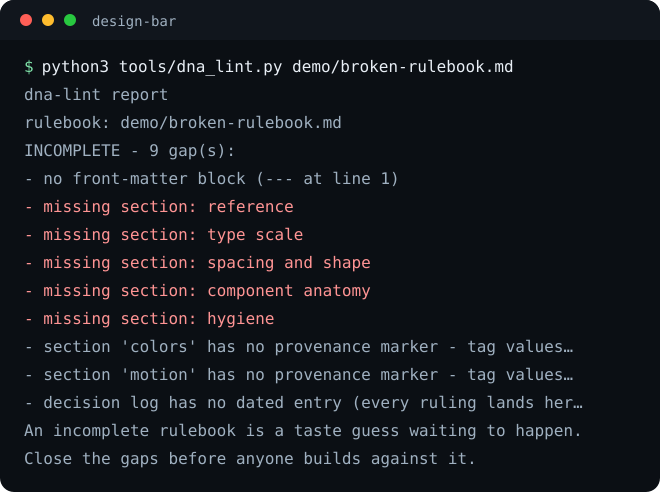
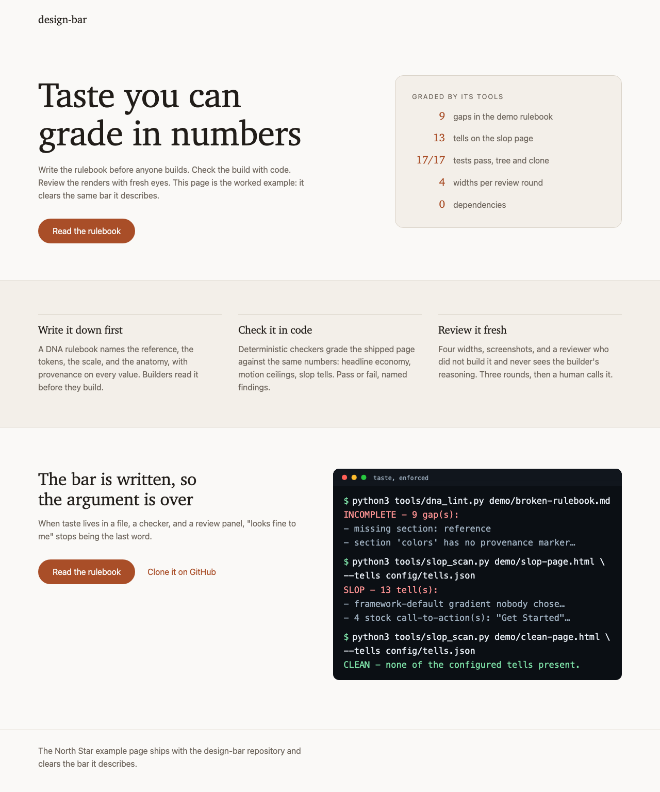

# design-bar

Every team has someone with taste. Almost no team can enforce it when
that person is not in the room. This is the pattern for writing taste
down until machines and strangers can hold the line: a DNA rulebook
builders read before they build, deterministic checkers that grade the
page after, a slop scanner for the defaults nobody chose, and a
fresh-eyes review panel with a hard round cap.




And the page those tools graded - the repo's own worked example, built
from `rulebook/example-dna.md`:



## Quick start

```bash
git clone https://github.com/eliferres/design-bar.git
cd design-bar
python3 tools/dna_lint.py demo/broken-rulebook.md
python3 tools/slop_scan.py demo/slop-page.html --tells config/tells.json
```

Zero dependencies: stdlib Python 3.9+ and plain bash. Both commands
above fail on purpose - the demo ships a vague rulebook and a sloppy
page so you can watch each tool name what is wrong.

## The system, in four parts

**1. The rulebook comes first.** A design DNA file names the one
reference the surface copies (with proof it earns the job), the color
tokens by job, the type scale, spacing, component anatomy, and motion -
and every value carries provenance: `(measured ...)` from the reference,
`(ruling ...)` from a human, or an honest `DEEPEN` gap. Builders read it
in full before building. `rulebook/TEMPLATE.md` is the blank;
`rulebook/example-dna.md` is a worked example. `tools/dna_lint.py`
refuses a rulebook without the anatomy, so "we have design guidelines"
stops being a sentence anyone can say without a file to show for it.

**2. Checkers grade the build.** The rulebook's numbers become a
machine-checkable bar. The full worked example is
[website-bar](https://github.com/eliferres/website-bar), a standalone
zero-dependency checker whose example config carries the same numbers as
`rulebook/example-dna.md` - the taste is written once and enforced
twice, before the build there and after the build here.

**3. Fresh eyes review the renders.** `tools/capture.sh` screenshots the
page at 320, 375, 768, and 1280, and `panel/REVIEW-BRIEF-TEMPLATE.md` is
the dispatch: the reviewer gets the ask, the rulebook, and the shots -
never the builder's reasoning. Three rounds maximum, then a human
decides. The cap is what makes the panel a tool instead of a treadmill.

**4. The slop scanner catches what nobody chose.** Structural tells of
generated design - the default gradient, the same shadow on every box,
emoji headings, `alt="image"`, stock button text - each a deterministic
check driven by `config/tells.json`, which is yours to tune.

## The walkthrough

A vague rulebook, refused with names:

```bash
python3 tools/dna_lint.py demo/broken-rulebook.md
```

```text
dna-lint report
rulebook: demo/broken-rulebook.md

INCOMPLETE - 9 gap(s):
  - no front-matter block (--- at line 1)
  - missing section: reference
  - missing section: type scale
  - missing section: spacing and shape
  - missing section: component anatomy
  - missing section: hygiene
  - section 'colors' has no provenance marker - tag values with (measured ...), (ruling ...), or an explicit DEEPEN gap
  - section 'motion' has no provenance marker - tag values with (measured ...), (ruling ...), or an explicit DEEPEN gap
  - decision log has no dated entry (every ruling lands here as '- YYYY-MM-DD (who): what was decided')

An incomplete rulebook is a taste guess waiting to happen.
Close the gaps before anyone builds against it.
```

The worked example, complete - including an honestly named hole:

```bash
python3 tools/dna_lint.py rulebook/example-dna.md
```

```text
dna-lint report
rulebook: rulebook/example-dna.md

COMPLETE - all sections present, provenance tagged (1 DEEPEN gap(s) named - honest, allowed).
Builders read this file in full before building.
```

The slop specimen, caught thirteen ways:

```bash
python3 tools/slop_scan.py demo/slop-page.html --tells config/tells.json
```

```text
slop-scan report
page:  demo/slop-page.html
tells: config/tells.json

SLOP - 13 tell(s):
  - banned phrase present: "in today's fast-paced world"
  - banned phrase present: "unlock the power of"
  - banned phrase present: "take your business to the next level"
  - banned phrase present: "we've got you covered"
  - banned phrase present: "game-changing"
  - banned phrase present: "revolutionize the way you"
  - placeholder copy: lorem ipsum shipped to a reader
  - 4 heading(s) open with emoji (limit 0): first is "🚀 Blazing performance"
  - placeholder alt text "image" on placeholder.png
  - image without alt text: placeholder2.png
  - framework-default gradient nobody chose: #667eea + #764ba2
  - the same box-shadow appears 4 times (limit 3): 0 4px 6px rgba(0, 0, 0, 0.1) - one elevation for everything is a tell, not a system
  - 4 stock call-to-action(s) (limit 0): "Get Started", "Learn More"
```

And the clean page, which is also the repo's own proof - it was built
from `rulebook/example-dna.md` and clears both the scanner and the
website-bar checker:

```bash
python3 tools/slop_scan.py demo/clean-page.html --tells config/tells.json
```

```text
slop-scan report
page:  demo/clean-page.html
tells: config/tells.json

CLEAN - none of the configured tells present.
That clears the floor, not the bar: a page can pass every
mechanical tell and still be dull. The review panel judges that.
```

To finish the loop, capture the clean page at the four review widths and
hand the shots to someone who did not build it:

```bash
bash tools/capture.sh demo/clean-page.html shots/
```

## Make it yours

1. Copy `rulebook/TEMPLATE.md`, pick ONE reference, measure it, fill
   every section, and lint until COMPLETE.
2. Turn the numbers into a checker config (fork website-bar's, or write
   your own - any script that reads your numbers and exits nonzero).
3. Tune `config/tells.json` to the defaults you keep meeting.
4. Wire all three into CI, and run the review panel on anything a
   stranger will see.

## Honest limitations

- The checkers grade the floor, not the ceiling. A page can pass every
  mechanical check and still be dull; that is why the panel exists.
  Taste does not fully compile.
- `dna_lint.py` checks anatomy, not truth. Write a wrong measured value
  and it will pass; the linter makes guessing visible, not impossible.
- The tells list is a record of defaults we kept meeting, not a theory
  of bad design. It ages, and it needs tuning to your stack.
- `capture.sh` needs a Chrome-family browser on the machine, and the
  panel is only as good as the reviewer you hand the shots to.
- `capture.sh` shoots a fixed viewport, 2400px tall by default.
  `shot_guard.py` fails the capture loudly when content reaches a
  shot's bottom edge instead of cropping in silence - raise
  `DESIGN_BAR_HEIGHT` and recapture - and trims the blank canvas off a
  good shot so it ends just below the content. A crop that lands in
  blank space between sections can still slip past the guard; it
  checks the edge, not the whole page.

## License

MIT.
